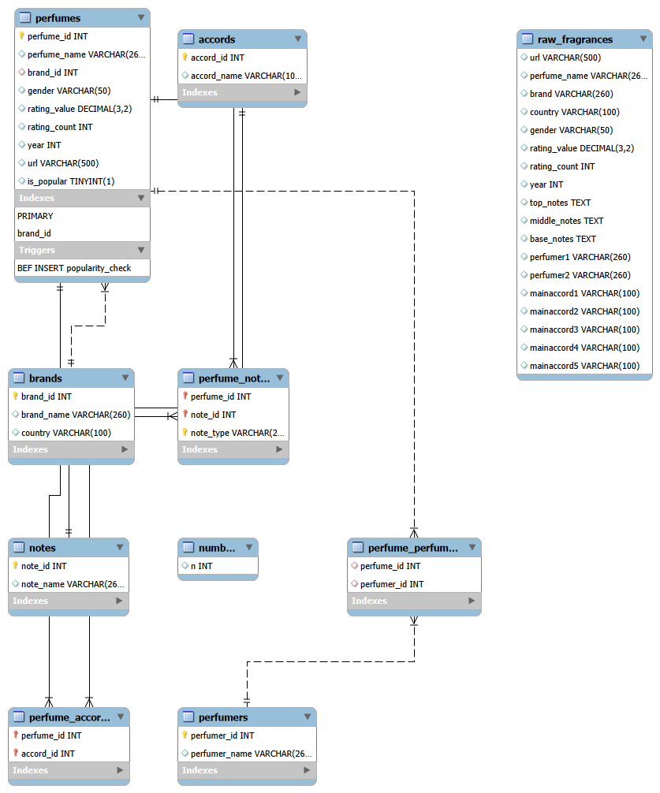

# Luxury Fragrance SQL Portfolio Project

## Overview

This is a SQL project built around a luxury perfume dataset I found on Kaggle. It has details like brands, countries, rating, gender, fragrance notes, and accords for a large number of perfumes. The raw data was pretty messy. For example, all the fragrance notes were crammed into a single column, and some fields used comma decimals instead of periods, which broke basic calculations.

So the first part of the project was cleaning all of that up and designing a proper relational schema, splitting things like notes and accords into their own tables and linking everything back together using foreign keys, instead of using one flat file.

Once the database was structured properly, I moved on to the actual analysis: 10 business questions, going from simple aggregations to more advanced stuff like CASE-based logics, multi-condition filtering, a CTE, a stored procedure, and a trigger. Each question was framed around something a real team would actually want to know from this kind of data.

Along the way I ran into several bugs while cleaning and querying the data. I've documented those below along with how I caught them.

Power BI Dashboard built on this database: https://github.com/Ayushi58/luxury-fragrance-powerbi-dashboard

## Tech Stack

- **Database:** MySQL
- **Tool:** MySQL Workbench — used for writing/running all queries, importing the raw CSV (via the built-in Import Wizard), and generating the ER diagram
- **Data source:** Kaggle (CSV)

## Database Schema

I started with a single raw table (`raw_fragrances`) imported from the Kaggle CSV- one flat table with columns mixed together: perfume name, brand, country, gender, rating value, rating count, top/middle/base notes, perfumers, and five main accord columns, all in one place.

From there, I normalized it into a proper relational structure:

- **`brands`** — one row per brand
- **`perfumes`** — one row per perfume, linked to `brands` via `brand_id`
- **`perfumers`** — one row per perfumer
- **`perfume_perfumers`** — junction table linking `perfumes` to `perfumers` (a perfume can have more than one perfumer)
- **`notes`** — individual fragrance notes (e.g. vanilla, bergamot)
- **`perfume_notes`** — junction table linking `perfumes` to `notes`, tagged by type (top/middle/base)
- **`accords`** — individual main accords
- **`perfume_accords`** — junction table linking `perfumes` to `accords`
- **`numbers`** — a small helper table used to split the comma-separated notes column into individual rows

Every junction table follows this pattern: two foreign keys, one pointing back to `perfumes.perfume_id`, and one pointing to whichever entity it links (`notes`, `accords`, or `perfumers`). This is what lets a single perfume have multiple notes, multiple accords, and multiple perfumers without duplicating perfume-level data across rows.

*Note: `raw_fragrances` and `numbers` appear disconnected in the diagram. `raw_fragrances` was the staging table used for the initial CSV import, and `numbers` is a helper table used to split comma-separated notes. Neither is part of the final normalized schema.*

## Data Cleaning & Bugs

The dataset had few real issues that appeared once I started building the normalized schema and running queries. Here's what came up, in the order I hit them:

| # | Bug | How I Caught It | Root Cause | Fix |
|---|---|---|---|---|
| 1 | Comma decimals in `rating_value` | Couldn't cast the column to DECIMAL | European-style CSV number formatting (e.g. `4,25` instead of `4.25`) | Kept it as VARCHAR, used REPLACE to swap commas for periods, then converted to DECIMAL |
| 2 | Only the first note was linked per perfume | Row counts were identical across top/middle/base note types which is a strong sign something was broken | A `REPLACE(text, ',', ' ')` call used a space instead of an empty string, so the comma count used for splitting was always 0 | Fixed the REPLACE logic, rebuilt the notes tables |
| 3 | Impossible `accord_count` of more than 5 (should max out at 5) | A sanity-check distribution query showed more than 5 buckets, which shouldn't exist | The join used perfume_name + brand_id, but a large number of those combinations weren't actually unique (e.g. multiple different perfumes from the same brand named "gold") | Rebuilt the join using `url` instead, which is truly unique per perfume |

## Business Questions

Once I had the database set up properly, I framed questions that would actually be useful from this data, each one maps to a real business role. I also made sure to progress from simple aggregations to more advanced techniques (CASE bucketing, multi-condition filters, CTEs).

**Q1 — Average rating by country**
For sourcing/buying decisions like which countries tend to produce higher-rated perfumes. This was the simplest first aggregation, and I noticed some countries had only 1-2 perfumes, which could make the average misleading, so I added `HAVING COUNT(*) >= 20`.

**Q2 — Most consistent brands**
Same logic as Q1, looking at brand consistency instead of country-level averages.

**Q3 — Top notes in perfumes rated above 4.0**
To see which notes show up most in highly-rated perfumes. Useful to understand what makes a perfume well-liked.

**Q4 — Best-rated perfumers (minimum 5 perfumes)**
To know which perfumers are worth working with. 

**Q5 — Average rating by decade**
Reveals whether ratings are actually improving over time, or whether it's more about reviewer culture shifting. First use of `CASE WHEN` to bucket a numeric year into decade categories.

**Q6 — Unisex perfume percentage trend by year**
This shows whether unisex perfumes have become more common over time, or if that's just what people assume. It's useful for spotting a real shift in what people are buying.

**Q7 — Hidden gem brands**
 Brands that are rated highly but are not well known yet, so still undervalued.

**Q8 — Polarizing perfumes**
Flags perfumes that lean on their brand's reputation despite being weaker individually than the brand's average. It needed a CTE, since a perfume's rating had to be compared against its own brand's average, which has to be calculated first before the comparison can happen.

**Q9 — Stored procedure: GetBrandReport**
Turns a repeatable lookup into something reusable on demand, instead of rewriting the same query every time someone wants a report on a specific brand.

**Q10 — Trigger: auto-flag popular perfumes**
Automation, new entries get flagged as popular automatically based on rating count, so no one has to remember to do it manually.

## How to Run It

1. **Create the database**
   CREATE DATABASE luxury_fragrance;
   USE luxury_fragrance;

2. **Run the schema section of the script** to create all tables: brands, perfumes, perfumers, perfume_perfumers, notes, perfume_notes, accords, perfume_accords, numbers.

3. **Import the raw CSV** into raw_fragrances using MySQL Workbench's Import Wizard.

4. **Run the data cleaning section** to fix the comma-decimal formatting in rating_value.

5. **Run the population section** to insert data into brands, perfumes, perfumers, and the junction tables, in that order (dependencies matter- junction tables need both parent tables already populated).

6. **Run the business questions** (Q1-Q8) to see the analysis results.

7. **Run the procedure and trigger section** (Q9-Q10) last, which creates GetBrandReport and the popularity_check trigger.

Requirements: MySQL and MySQL Workbench 
